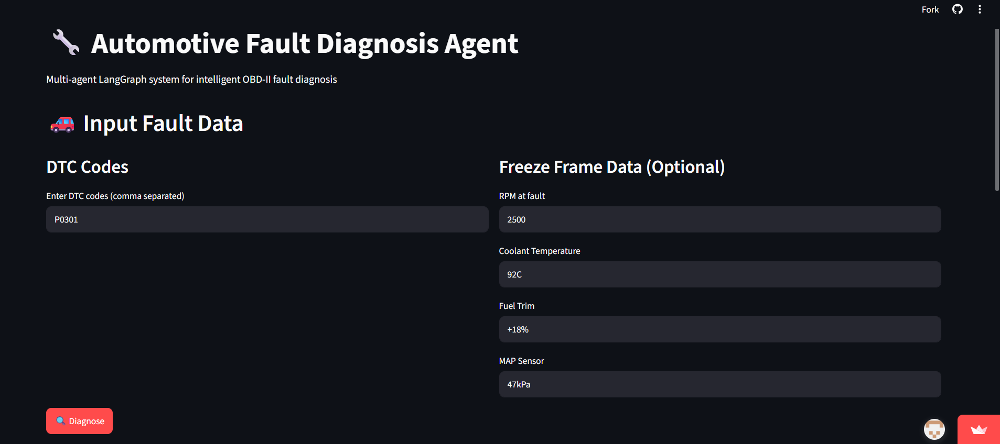
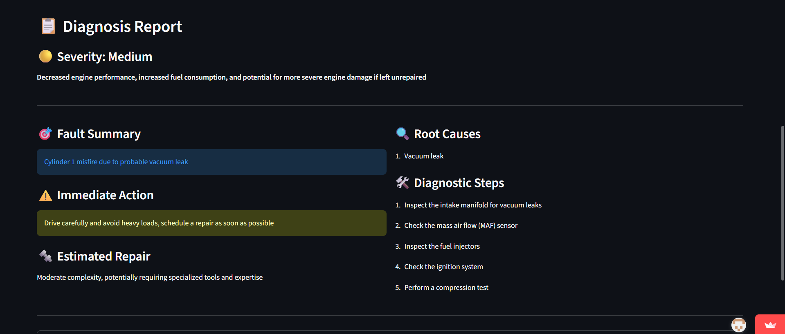
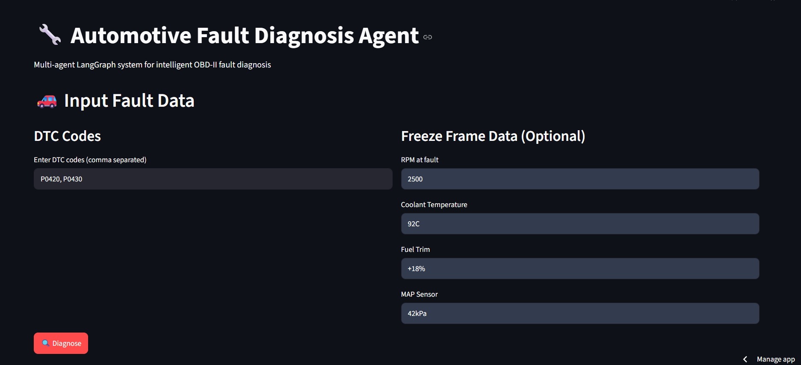
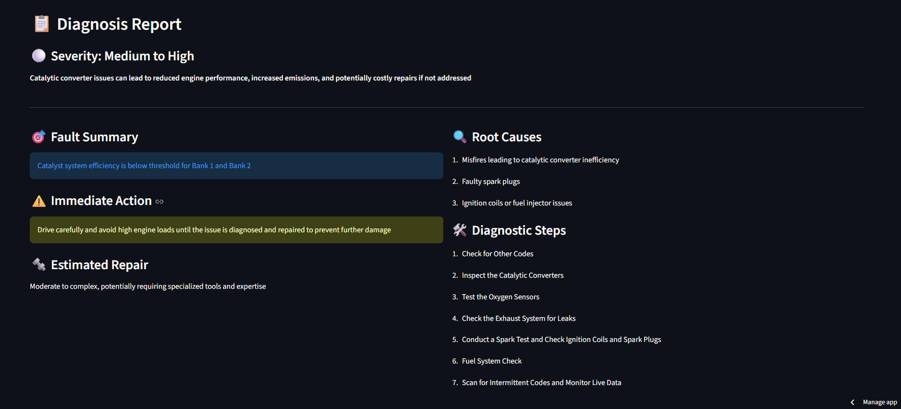

# 🔧 Automotive Fault Diagnosis Agent

A multi-agent LangGraph system that diagnoses automotive faults from DTC codes and freeze frame sensor data using hybrid RAG retrieval over OBD-II knowledge bases.

🚀 **[Live Demo](https://automotive-fault-diagnosis-agent-exhe8bkmwfbybjfhmstlzv.streamlit.app/)**

---

## 🚗 Problem Statement

When a vehicle throws a fault code, mechanics and engineers spend significant time manually cross-referencing DTC codes across repair manuals, technical service bulletins, and past repair histories.

Simply asking an LLM "what is P0301?" gives a generic answer. But real diagnosis requires reasoning over:
- **Freeze frame sensor data** (RPM, coolant temp, fuel trim, MAP at fault time)
- **Multi-fault correlation** (P0301 + P0171 + P0174 together = different diagnosis)
- **Manufacturer and model-specific repair knowledge**
- **Structured actionable output** a mechanic can actually use

This system automates real diagnosis — not just code lookup — using a multi-agent AI pipeline that retrieves specific fault knowledge and reasons through probable root causes, severity, and recommended repair actions.

---

## 📸 Demo

### Input


### Diagnosis Output


### Multi-Fault Diagnosis (P0300 + P0171 + P0174)



---

## 🏗️ Architecture

| Stage | Component | Description |
|-------|-----------|-------------|
| Input | User | DTC codes + freeze frame sensor data |
| Step 1 | Retrieval Agent | Hybrid search (Dense + BM25) over Qdrant |
| Step 2 | Diagnosis Agent | Multi-fault reasoning via LangGraph |
| Step 3 | Response Agent | Root cause + severity + repair steps |
| Output | Streamlit UI | Structured diagnosis displayed to user |

---

## ⚙️ Tech Stack

| Component | Technology |
|-----------|------------|
| Agent Orchestration | LangGraph |
| Vector Database | Qdrant Cloud |
| Hybrid Retrieval | Dense Embeddings + BM25 with RRF |
| Embeddings | sentence-transformers (all-MiniLM-L6-v2) |
| LLM | Llama 3.3-70b via Groq |
| UI | Streamlit |
| Language | Python 3.11+ |

---

## 🔄 How It Works

1. User inputs one or more DTC codes (e.g. `P0301`, `P0171`) and optional freeze frame sensor data via Streamlit UI
2. **Retrieval Agent** performs hybrid search — dense semantic search + BM25 keyword search — over 5564 OBD-II records stored in Qdrant Cloud
3. **Diagnosis Agent** receives retrieved context and reasons through probable root causes using LangGraph, accounting for multi-fault correlations and freeze frame sensor data
4. **Response Agent** formats structured output — root cause, severity rating, recommended repair steps, immediate action
5. Results displayed in a clean Streamlit interface

---

## 💡 Why Not Just Use an LLM Directly?

| Capability | LLM Alone | This System |
|------------|-----------|-------------|
| Generic DTC explanation | ✅ | ✅ |
| Freeze frame data reasoning | ❌ | ✅ |
| Multi-fault correlation | ❌ | ✅ |
| Manufacturer-specific knowledge | ❌ | ✅ |
| Structured repair output | ❌ | ✅ |

---

## 📁 Project Structure

| Path | Description |
|------|-------------|
| `agents/retrieval_agent.py` | Hybrid search over Qdrant |
| `agents/diagnosis_agent.py` | Freeze frame aware root cause reasoning |
| `agents/response_agent.py` | Structured JSON output formatting |
| `pipeline/graph.py` | LangGraph orchestration |
| `retrieval/embedder.py` | sentence-transformers embeddings |
| `retrieval/bm25_retriever.py` | BM25 keyword retrieval |
| `retrieval/hybrid_retriever.py` | Combined hybrid retrieval with RRF |
| `data/scraper.py` | OBDGuide.com scraper |
| `data/merge.py` | Multi-source knowledge base merger |
| `data/ingest.py` | Qdrant Cloud ingestion pipeline |
| `ui/app.py` | Streamlit UI |

---

## 🚀 Getting Started

### Prerequisites
- Python 3.11+
- Qdrant Cloud free tier account
- Groq API key (free at console.groq.com)

### Installation

```bash
git clone https://github.com/rithi107/Automotive-Fault-Diagnosis-Agent.git
cd Automotive-Fault-Diagnosis-Agent
python -m venv venv
venv\Scripts\activate        # Windows
pip install -r requirements.txt
cp .env.example .env         # Add your API keys
```

### Environment Variables

```env
QDRANT_URL=your_qdrant_cluster_url
QDRANT_API_KEY=your_qdrant_api_key
GROQ_API_KEY=your_groq_api_key
```

### Run

```bash
streamlit run ui/app.py
```

---

## 📊 Knowledge Base

| Source | Records | Content |
|--------|---------|---------|
| OBDGuide.com (scraped) | 2898 | Symptoms, causes, repair steps |
| Epitech/obd-codes-fine-tune (HuggingFace) | 3071 | DTC codes and fault names |
| **Merged Total** | **5564** | **Rich diagnostic content** |

---

## 🗺️ Roadmap

- [x] Project setup and architecture
- [x] OBD-II knowledge base ingestion pipeline
- [x] Qdrant Cloud hybrid retrieval setup
- [x] LangGraph multi-agent pipeline
- [x] Freeze frame aware diagnosis
- [x] Streamlit UI
- [x] Live deployment on Streamlit Cloud
- [ ] Multi-fault correlation improvements
- [ ] Docker support
- [ ] Vehicle make/model specific diagnosis

---

## 🙋‍♀️ Author

Rithika
Automotive BSW + GenAI Engineer
[LinkedIn] (www.linkedin.com/in/rithikag710) | [GitHub](https://github.com/rithi107)